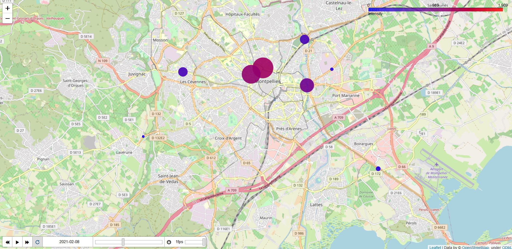

# Challenge




## Informations générales 
\
Dans un terminal, vous pouvez cloner le répertoire dans votre machine locale : 
```bash
$ git clone https://github.com/Assiab2707/packaging_challenge_brda.git
```

## Prédiction 

Dans cette partie, il s'agissait de prédire le trafic de vélos à Montpellier le vendredi 02 Avril entre 00h et 09h. Les données sont disponibles sur :  **https://docs.google.com/spreadsheets/d/e/2PACX-1vQVtdpXMHB4g9h75a0jw8CsrqSuQmP5eMIB2adpKR5hkRggwMwzFy5kB-AIThodhVHNLxlZYm8fuoWj/pub?gid=2105854808&single=true&output=csv**

L'url ci-dessous permet l'accès au compte-rendu sur le processus de prédiction : 

**https://github.com/Assiab2707/packaging_challenge_brda/blob/19acf156c5fc5ea786d5b23162a22ecf7051d9a1/BERRANDOU_Assia_challenge.pdf**

### Sources :

 - **https://towardsdatascience.com/machine-learning-polynomial-regression-with-python-5328e4e8a386**


## Visualisation

Dans cette partie, il s'agissait de visualiser le trafic de vélos à Montpellier à l'aide des données disponibles sur : **https://data.montpellier3m.fr/dataset/comptages-velo-et-pieton-issus-des-eco-compteurs**. Pour ce faire, j'ai utilisé les données dont le format est *MMM_EcoCompt_<numéro_compteur>_archive.json*.


\
J'ai décidé de créer une visualisation intéractive. En effet, cette dernière varie en fonction de la date : 
- possibilité de voir l'évolution du trafic sous forme de vidéo  
- possibilité de changer la date à l'aide du TimeSlider

 De plus, en cliquant sur les différents marqueurs, on peut avoir accès à l'intensité du trafic en ce lieu à la date indiquée.

\
L'url, ci-dessous, vous permet d'avoir accès à cette visualisation : 

**https://assiab2707.github.io/packaging_challenge_brda/**


### Sources :
  - **https://towardsdatascience.com/visualizing-nyc-bike-data-on-interactive-and-animated-maps-with-folium-plugins-c2d7645cd19b**


